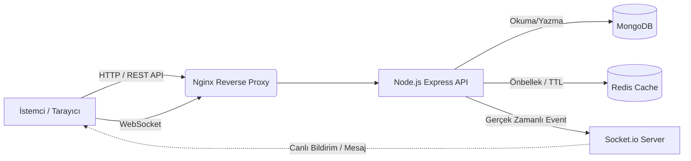

<h1 align="center">
  <br>
  ⚡ MERN Stack V2 — Ultimate Edition
  <br>
</h1>

<h4 align="center">Modern, Güvenli ve Tam Kapsamlı (Full-Stack) Web Uygulaması Altyapısı</h4>

<p align="center">
  
  
  
  
  
</p>

<p align="center">
  <a href="#proje-hakkında">Proje Hakkında</a> •
  <a href="#özellikler">Özellikler</a> •
  <a href="#teknoloji-yığını">Teknoloji Yığını</a> •
  <a href="#kurulum-ve-başlangıç">Kurulum</a> •
  <a href="#api-dokümantasyonu">API Dokümantasyonu</a> •
  <a href="#docker-desteği">Docker</a>
</p>

---

## 🚀 Proje Hakkında

Bu proje, gerçek dünya senaryolarına uygun, üretime hazır (production-ready) bir MERN (MongoDB, Express, React, Node.js) mimarisi sunar. Basit bir CRUD uygulamasının ötesine geçerek; **İki Faktörlü Doğrulama (2FA)**, **Gerçek Zamanlı Sohbet**, **Redis Önbellekleme (Caching)**, **Gelişmiş Güvenlik Önlemleri** ve **Uçtan Uca CI/CD (GitHub Actions)** süreçlerini barındırır.

Geliştiricilerin hızlıca projelerine entegre edebilecekleri, ölçeklenebilir ve temiz kod prensipleriyle (Clean Code) hazırlanmış bir "Boilerplate" veya ana proje niteliğindedir.

---

## ✨ Özellikler

### 🛡️ Gelişmiş Kimlik Doğrulama & Güvenlik (Auth & Security)
- **JWT Altyapısı:** Access ve Refresh token mantığıyla güvenli oturum yönetimi.
- **2FA (Two-Factor Authentication):** Google Authenticator destekli iki adımlı doğrulama.
- **Email Doğrulaması:** Kayıt sonrası OTP/Link ile hesap onayı (Nodemailer).
- **Şifre Sıfırlama:** "Şifremi Unuttum" e-posta akışı.
- **Güvenlik Kalkanı:** XSS Koruması, NoSQL Injection engelleme, Helmet HTTP başlıkları, Rate Limiting (IP tabanlı istek sınırlandırma).

### 💬 Gerçek Zamanlı İletişim (Real-time Socket.io)
- **Çoklu Sohbet Odaları:** General, Random, Tech gibi dinamik oda desteği.
- **Mesaj Yönetimi:** Mesaj düzenleme ve silme (Soft-delete yeteneği).
- **Dosya Paylaşımı:** Sohbet içerisinden anında resim/dosya yükleme (Multer).
- **Canlı Bildirimler:** Uygulama içi (In-app) okunmamış bildirim zili ve uyarıları.

### 🎨 Modern Kullanıcı Arayüzü (React Frontend)
- **Dark/Light Mod:** Kullanıcı tercihini hatırlayan, geçiş animasyonlu tema altyapısı.
- **Responsive Tasarım:** Mobil uyumlu, hamburger menülü tam esnek (Fluid) tasarım.
- **Animasyonlar:** Framer Motion ile tasarlanmış pürüzsüz sayfa ve bileşen geçişleri.
- **UX İyileştirmeleri:** LocalStorage destekli arama geçmişi tutma, Skeleton (iskelet) yükleme ekranları ve gelişmiş Toast bildirimleri (react-hot-toast).
- **Admin Paneli:** Kullanıcı rolleri (Admin, Mod, User) yönetimi, sistem istatistikleri ve analiz grafikleri (Recharts).

### ⚙️ DevOps & Mimari (Backend & CI/CD)
- **Redis Cache:** Sık erişilen veriler için (ör. kullanıcı profilleri) `ioredis` ile ultra hızlı yanıt süreleri.
- **Swagger API:** Tüm endpoint'leri kapsayan interaktif `/api-docs` arayüzü.
- **Winston Logger:** Hataları ve sistem olaylarını tarihe göre log dosyalarına kaydeden profesyonel takip sistemi.
- **Dockerized:** Tek bir `docker-compose.yml` dosyası ile saniyeler içerisinde veritabanı, cache ve uygulamanın tamamen ayağa kalkması.
- **CI/CD Pipeline:** Her push/PR işleminde çalışan otonom test (Jest) ve Build süreçleri (GitHub Actions).

---

## 🛠️ Teknoloji Yığını

### Frontend
- **Kütüphane:** React (v18)
- **Routing:** React Router DOM (v6)
- **Animasyonlar:** Framer Motion
- **Bildirimler:** React Hot Toast
- **Grafikler:** Recharts
- **HTTP İstemcisi:** Axios

### Backend
- **Ortam:** Node.js & Express.js
- **Veritabanı:** MongoDB & Mongoose ORM
- **Önbellek (Cache):** Redis (ioredis)
- **WebSockets:** Socket.io
- **Dokümantasyon:** Swagger UI Express
- **Test:** Jest & Supertest
- **Dosya Yükleme:** Multer

### DevOps & Diğer
- **Konteynerleştirme:** Docker & Docker Compose
- **Ters Vekil (Reverse Proxy):** Nginx
- **Sürekli Entegrasyon (CI):** GitHub Actions

---

## 🏗️ Mimari Şema



---

## 🏁 Kurulum ve Başlangıç

Projeyi kendi bilgisayarınızda çalıştırmak için aşağıdaki adımları izleyin.

### Ön Koşullar
Bilgisayarınızda şunların kurulu olduğundan emin olun:
- [Git](https://git-scm.com/)
- [Node.js](https://nodejs.org/) (v18 veya üzeri)
- [Docker & Docker Compose](https://www.docker.com/) *(İsteğe bağlı, kolay kurulum için önerilir)*

### Seçenek 1: Docker İle Çalıştırma (Tavsiye Edilen 🌟)

En temiz ve sorunsuz kurulum yöntemidir. Veritabanı ve Redis kurmanıza gerek kalmaz.

```bash
# 1. Repoyu klonlayın
git clone https://github.com/ferhatolmez/mernapp.git
cd mernapp

# 2. Docker Compose ile tüm sistemi ayağa kaldırın
docker-compose up -d --build
```

**Erişim Noktaları:**
- 🌐 Frontend: `http://localhost:3000` (veya `http://localhost` Nginx üzerinden ayarlandıysa)
- 🔌 Backend API: `http://localhost:5000/api`
- 📚 API Dokümantasyonu: `http://localhost:5000/api-docs`

---

### Seçenek 2: Manuel Geliştirici Ortamı (Localhost)

Eğer projeyi geliştirmek ve kodlarda değişiklik yapmak istiyorsanız bu yöntemi seçin.

#### 1. Backend Kurulumu
```bash
cd backend
npm install

# .env.example dosyasının kopyasını .env olarak oluşturun
cp .env.example .env
```
> ⚠️ **ÖNEMLİ:** `.env` dosyanızı açıp içindeki `MONGODB_URI` ve `JWT` Secret anahtarlarını kendinize göre düzenlemeyi unutmayın. (Redis opsiyoneldir, yoksa uygulama cache olmadan çalışmaya devam eder).

```bash
# Backend'i geliştirici modunda başlatın
npm run dev
```

#### 2. Frontend Kurulumu
Yeni bir terminal sekmesi açın:
```bash
cd frontend
npm install
npm start
```
Frontend başarıyla derlendiğinde tarayıcınızda `http://localhost:3000` adresi otomatik açılacaktır.

---

## 🔒 Ortam Değişkenleri (.env)

Backend dizinindeki `.env` dosyanız şu şekilde görünmelidir:

```env
# SUNUCU
PORT=5000
NODE_ENV=development

# VERİTABANI
MONGODB_URI=mongodb+srv://<kullanici_adiniz>:<sifreniz>@cluster.mongodb.net/mernapp

# GÜVENLİK (JWT)
JWT_ACCESS_SECRET=cok_gizli_access_anahtari_buraya
JWT_REFRESH_SECRET=cok_gizli_refresh_anahtari_buraya
JWT_ACCESS_EXPIRES=15m
JWT_REFRESH_EXPIRES=7d

# E-POSTA (Production için SMTP)
EMAIL_HOST=smtp.gmail.com
EMAIL_PORT=587
EMAIL_USER=<kendi_mail_adresiniz_buraya>
EMAIL_PASS=<gmail_uygulama_sifreniz_buraya>

# REDIS (Opsiyonel)
REDIS_URL=redis://localhost:6379

# FRONTEND ERİŞİMİ
CLIENT_URL=http://localhost:3000
```

---

## 🧪 Testleri Çalıştırma

Projenin sağlığı açısından yazılmış kapsamlı Unit ve Integration testleri bulunmaktadır.

```bash
cd backend
npm run test
```
*Testler; Jest ve Supertest kütüphaneleri kullanılarak ağırlıklı olarak Auth (Kimlik doğrulama) ve performans/sağlık uç noktalarını kapsar.*

---

## 🤝 Katkıda Bulunma

1. Bu depoyu forklayın (`Fork`).
2. Kendi özellik dalınızı oluşturun (`git checkout -b feature/YeniOzellik`).
3. Değişikliklerinizi commit edin (`git commit -m 'feat: Harika bir özellik eklendi'`).
4. Dalınıza pushlayın (`git push origin feature/YeniOzellik`).
5. Bir Pull Request açın!

---

## 📄 Lisans

Bu proje **MIT Lisansı** altında lisanslanmıştır - daha fazla detay için [LICENSE](LICENSE) dosyasına bakabilirsiniz.

<br>

<div align="center">
  <b>Tasarım ve Geliştirme:</b> ❤️ ile üretilmiştir. MERN yeteneklerinizi bir üst seviyeye taşıyın!
</div>
